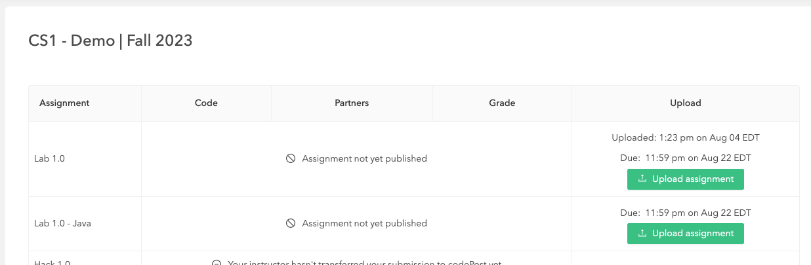
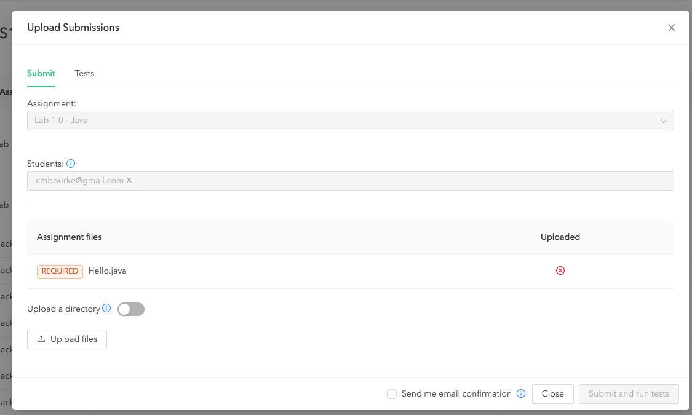

# Computer Science I
## Lab 1.0 - Introduction
### Java Version
[School of Computing](https://computing.unl.edu)  
[College of Engineering](https://engineering.unl.edu/)  
[University of Nebraska-Lincoln](https://unl.edu)  

This lab introduces you to your programming environment and the
software development workflow and handin/grading process used
by this course.  

## Prior to Lab

In each lab there may be pre-lab activities that you are *required* to
complete prior to attending lab. Failure to do so may mean that you are
not prepared to complete the lab.

1.  For this lab, you'll need to sign up with GitHub, a website that
    hosts *software repositories* using git (a distributed version
    control system). With GitHub you'll be able to store, manage and
    backup your source code. Git is an essential software development
    tool that you'll want to fully utilize.

    Go to <https://github.com> and sign up if you don't have an account
    already.

2.  Accept the invite that your instructor sent out from
    [codepost.io](https://codepost.io) and be sure you can sign in.
    Graders will provide line-by-line feedback on  your hacks, exams
    and other assignments using this site.

Some other School of Computing (Soc) and university computing resources and policies
can be found at the following:

  -   SoC Website: <http://computing.unl.edu>

  -   UNL Computing Policy: <http://www.unl.edu/ucomm/compuse/>

  -   SoC Academic Integrity Policy:
      <http://computing.unl.edu/academic-integrity-policy>

  -   SoC System Frequently Asked Questions (FAQ):
      <http://computing.unl.edu/faq>

  -   SoC Undergraduate Advising Page: <http://computing.unl.edu/advising>

  -   SoC Student Resource Center: <http://computing.unl.edu/src>

## Peer Programming Pair-Up

***For students in online section(s):*** you may complete
the lab on your own if you wish or you may team up with a partner
of your choosing.

***For students in the on campus section:*** your lab instructor
may team you up with a partner.  

To encourage collaboration and a team environment, labs are be
structured in a *peer programming* setup.  At the start of
each lab, you will be randomly paired up with another student
(conflicts such as absences will be dealt with by the lab instructor).
One of you will be designated the *driver* and the other
the *navigator*.  

The navigator will be responsible for reading the instructions and
telling the driver what to do next.  The driver will be in charge of the
keyboard and workstation.  Both driver and navigator are responsible
for suggesting fixes and solutions together.  Neither the navigator
nor the driver is "in charge."  Beyond your immediate pairing, you
are encouraged to help and interact and with other pairs in the lab.

Each week you should alternate: if you were a driver last week,
be a navigator next, etc.  Resolve any issues (you were both drivers
last week) within your pair.  Ask the lab instructor to resolve issues
only when you cannot come to a consensus.  

Because of the peer programming setup of labs, it is absolutely
essential that you complete any pre-lab activities and familiarize
yourself with the handouts prior to coming to lab.  Failure to do
so will negatively impact your ability to collaborate and work with
others which may mean that you will not be able to complete the
lab.  

## Lab Objectives & Topics

At the end of this lab you should be familiar with the following

  -   The [Eclipse](https://eclipse.org/) IDE that
      you'll use for this course (recommended)

  -   Cloning lab code from Github using Eclipse

  -   Modifying, compiling and executing your first Java program

  -   Using [codepost.io](https://codepost.io) to view grader
      feedback

# Activities

## Getting Started

Let's get started. In order to develop programs in Java you'll need:
 * a code editor (plain text editor) to write your code
 * a compiler to compile the Java code into Java Bytecode that can
   be run by a Java Virtual Machine (JVM), and
 * a runtime environment to actually execute your program

To do this, we'll walk you through how to use Eclipse, a popular (and
*free*) IDE (Integrated Development Environment).

1. Go to Oracle's website and download and install the Java Development
  Kit (JDK).  You may already have "Java" installed but likely it is the
  *Java Runtime Environment* (JRE) that allows you to run Java programs.  
  The Dev Kit allows you to *develop* programs.  You should install the
  latest version:

  <https://www.oracle.com/java/technologies/downloads/>

2. Got to [Eclipse.org](https://www.eclipse.org/) and download/install
  the Eclipse IDE.  It is perfectly fine to use an alternative
  IDE if you wish, but instructions for all labs will assume Eclipse.  

## Creating a New Project

### Using Eclipse

1. Once installed, start Eclipse
2. Choose a workspace directory/folder where you want all of your
   future projects to exist.
3. Close the Welcome screen, and create a new project:  
  a. Select:  `File > New > Project`  
  b. Select `Java Project` when prompted by the `New Project Wizard`; click `Next`  
  c. Enter a name for your project (`Lab01`); click Finish  
  d. Open the `Lab01` folder in the `Package Explorer View` and find the `src` folder  
  e. Right-click on the `src` folder and select `New Class` and name it `Hello`  
  f. This should open a new source code editor.  Make your program
  look like the following and save it.

```java
public class Hello {

  public static void main(String args[]) {
    System.out.println("Hello World!");
  }

}
```

4. Run your program by clicking the "play" button in the tool bar

**Congratulations on your first program!**

### Checking Out Code From Github

Each lab will have some starter code and other *artifacts* (data files,
scripts, etc.) that will be provided for to you.  However, the code is hosted
on [GitHub](https://github.com) and you must check it out.  

1. First we need a Git *perspective* (a context in the Eclipse
   User Interface that will allow us to work with Git).  To open the
   Git perspective, click on the `Open Perspective` tab in the upper right:

   

2. Select `Git` from the menu and click OK

3. Click the `Clone a Git repository` in the Git Repositories navigation menu:

   

4. Copy/paste or type into the URI field, the URL:
   <https://github.com/cbourke/CSCE155-Java-Lab01>
   and click `Next`

   

5. Once Eclipse has cloned the project, the `master` branch should
   be selected (checkbox); click `Next` again.

   

6. Select the directory where you want your project to be saved.  
   **Caution**: the default option may not correspond to your default
   workspace.  You may want to change it to your workspace, but the choice
   is yours.  Also mark the `Import all existing projects after clone finishes`
   checkbox option or you will need to manually import the cloned project
   into Eclipse.

   

7. Switch back to your Java or JavaEE perspective and you can see
   your cloned project.

8. Run the `Hello.java` program in this project to verify everything works.

   Observe that this version of the program is in a different *package*.
   Java organizes code and classes using directories (folders) or
   "packages".  This class has been placed into a directory/package named
   `unl` under yet another subdirectory/folder/package called `soc`.

### Modify the Program

1. Modify the `Hello.java` program by changing the author to you (and your
   partner) and change the date.

2. Add a new line *below* the line that prints `Hello World!` that
   prints `I love the School of Computing!` using the other line
   as an example.

3. Rerun the program to verify it compiled and runs.

## Submitting & Grading Your Program

Nearly all of your assignments (labs, hacks, exams) will include a
programming portion that will require you to hand in source files
for graders to compile and evaluate.  To do this, we use a web-based
assessment app called codepost.io (<https://codepost.io>).  

You should have received an invitation to this website from your
instructor through your email account (typically your `@huskers.unl.edu`
email or whatever email you have associated with on Canvas).  If
you have access, great.  If not, go to <https://codepost.io/forgot-password>
and "reset" your password (even if you never initially set one).  Be
sure to use your huskers email or whatever primary email is associated
with your canvas profile.

To handin and grade your lab, do the following.

1. Login to <https://codepost.io>.  It should immediately take you to the
   assignment submission page:



3. Click "Upload Assignment" which will bring up a dialog box:



Click "Upload files" and select the `Hello.java` source file you downloaded.
Then click 

4. You should see something like the following:


***HOWEVER*** this does not mean that your program(s) worked, only that
they were uploaded.  You ***still need to view the results!!!***

5. Click on  to
view the test results which will give you more details.  If any
test(s) failed, you should see:


You can click on the + button to see more details.  However, if
all tests passed, you should see something like this:


Some things to understand about the grading process:

 * If there are problems or errors with your program(s),
   you should fix/debug them and repeat the handin/grading process.
	 You can do this as many times as you like up until the due date.  
 * Some programs and assignments *may* require the output to be *exact*
   including any upper/lower case text and numbers accurate to a
   certain number of decimal points
 * Some programs and assignments may only require part of the output to be correct and may
   ignore other formatting (spaces for example).
 * Some programs and assignments may need to be manually examined by
   graders to award points.
 * Some programs and assignments have more
   sophisticated test suites that run hundreds or thousands of tests.
 * In any case, it is **your responsibility to read, understand
   and *address* any and all errors and/or warnings that the grader
   produces**.
 * The grader is a **black box** tester meaning you don't have
   access to its internal workings.  You should properly and thoroughly test
   and debug your programs locally instead of relying on it as a
   "blind tester."

***Congratulations on your first lab!***
